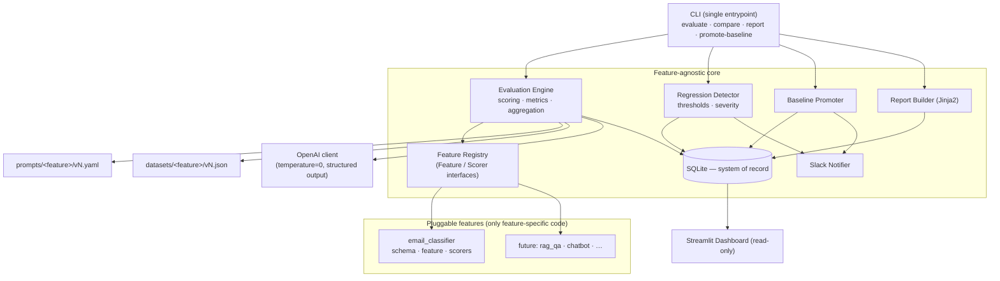
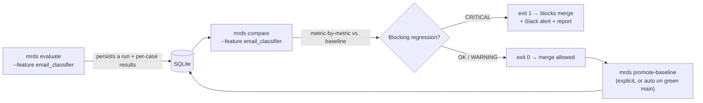

# Model Regression Detection System (MRDS)

> **An AI evaluation platform and deployment-safety system for LLM-powered features.**
> MRDS continuously tests AI features against versioned "golden" datasets, scores them, compares every candidate against a promoted baseline, detects quality **regressions**, generates reports, sends Slack alerts, and **blocks deployments when quality drops** — the same way unit tests and CI block buggy code from shipping.

🔗 **Live dashboard:** [modelregressiondetector.streamlit.app](https://modelregressiondetector.streamlit.app) &nbsp;•&nbsp; 📐 [Architecture](docs/architecture.md) &nbsp;•&nbsp; 🤖 [Agent context](CLAUDE.md)

---

## 1. Project Overview

Most software has a safety net: write code, run tests, and CI refuses to merge anything that breaks them. **AI features have no such net by default.** A reworded prompt, a model upgrade, or a new training example can quietly make an LLM feature *worse* — and nobody notices until customers do.

**MRDS is that missing safety net for AI.** It treats prompts, datasets, and models as versioned, testable artifacts, runs them through a custom evaluation engine, and uses a regression gate to stop quality drops before they reach production.

The platform is **feature-agnostic**. A new AI feature plugs in by implementing one interface — the evaluation engine, regression detector, reporting, alerting, database, and CLI never change. The included **Customer Support Email Classifier** is simply the first feature under test.

---

## 2. Problem Statement

When you build a feature on top of a large language model, "is it good?" is surprisingly hard to answer — and "did my last change make it worse?" is harder still:

- **LLM output is non-deterministic and hard to diff.** You can't just `assert output == expected`; quality is fuzzy and multi-dimensional (correct? well-summarized? fast? cheap?).
- **Tiny changes have outsized effects.** Editing one line of a prompt, bumping a model version, or adding examples can shift behavior on inputs you weren't even thinking about.
- **Regressions are invisible.** Without a baseline to compare against, a 6% accuracy drop looks identical to a good day. It surfaces as customer complaints, not a failed build.
- **Evaluation is usually ad-hoc.** Teams eyeball a handful of examples in a notebook, then ship. There's no history, no gate, no alert, and no reproducibility.

The result: AI features degrade silently, and teams find out last.

---

## 3. Solution Overview

MRDS turns LLM evaluation into a disciplined, automated engineering practice:

| Capability | What it means |
|---|---|
| **Versioned golden datasets** | Hand-curated test cases (input → expected output) are versioned and immutable — your "ground truth." |
| **Versioned prompts** | Every prompt lives in a YAML file with a version; you create `v2` rather than editing `v1`. |
| **Custom evaluation engine** | Runs a feature against a dataset, scores each case with deterministic scorers, and aggregates accuracy, latency, and token/cost metrics. |
| **Baseline comparison** | Each candidate run is compared, metric-by-metric, against the currently *promoted* baseline. |
| **Regression detection** | Configurable thresholds classify each metric move as **OK**, **WARNING**, or **CRITICAL**. |
| **Quality gate (fail-closed)** | A critical regression makes the CLI exit non-zero, which **blocks the merge** in CI. |
| **Explicit baselines** | Baselines are never silently overwritten by a worse run; promotion is deliberate (or auto-promoted only on a green `main`). |
| **Reports, alerts, history** | Markdown reports, Slack alerts on regressions/promotions, and a read-only dashboard over the full history. |

Everything is **reproducible**: every run pins a prompt version, a dataset version, and a model, and runs at `temperature=0`. Identity of prompts and datasets is their **content hash**.

---

## 4. Architecture

A **feature-agnostic core** orchestrates everything; the only feature-specific code lives behind a plug-in interface.



**Key principles enforced by the design:**

- **Feature-agnostic core.** The engine, detector, reporting, alerting, DB, and CLI never reference a specific feature — they work through the registry. Adding a feature requires **zero** changes to them.
- **CLI-first.** One entrypoint runs identically locally and in GitHub Actions, so CI behavior equals local behavior.
- **SQLite is the system of record.** Six tables — `prompt_versions`, `dataset_versions`, `runs`, `test_results`, `baselines`, `regressions` — and all writes go through a repository layer. Reports and the dashboard are derived views.
- **Fail-closed.** The quality gate blocks by default; a critical regression is a non-zero exit code.

---

## 5. Core Features

- 🧩 **Pluggable feature registry** — features implement a small `Feature` + `Scorer` interface and self-register. The first feature (email classifier) ships built-in.
- 🧪 **Custom evaluation engine** — no black-box framework; scores each case, then aggregates **pass rate**, per-scorer means, **segment** breakdowns, **latency** (mean / p50 / p95 / min / max), **token usage**, and **error counts**.
- 📊 **Threshold-based regression detection** — quality metrics gate on absolute *and* relative drops; latency/tokens gate on relative increases; errors gate on count increases. Severity is **WARNING** or **CRITICAL**, with optional per-metric overrides.
- 🚦 **Deployment quality gate** — `compare` returns exit code `1` on a blocking (critical) regression; CI keys the merge gate off that exact code.
- 📌 **Explicit, safe baselines** — a worse run never silently replaces the baseline; promotion is deliberate (or auto-promoted only when `main` is green).
- 📝 **Versioned, immutable prompts & datasets** — identified by content hash for full reproducibility.
- 📄 **Markdown reports** rendered with Jinja2, saved per run and uploaded as CI artifacts.
- 🔔 **Slack alerting** on regressions and promotions — best-effort and non-blocking.
- 📈 **Read-only Streamlit dashboard** over runs, trends, regressions, and baselines.
- 🧰 **Cost-aware by default** — `temperature=0`, deterministic scorers for gating, LLM-as-judge **off in CI**, smoke subsets on PRs and full datasets nightly.
- ✅ **Fully testable** — the OpenAI API is **always mocked** in tests; metrics and thresholds are pure functions; tests assert exact metrics and exact CLI exit codes.

---

## 6. Evaluation Workflow

The four CLI commands compose into the full lifecycle:



1. **`mrds evaluate`** — runs a feature against its golden dataset (pinning prompt + dataset + model), scores every case, aggregates metrics, and persists a **run** with all per-case `test_results`.
2. **`mrds compare`** — compares the candidate run to the active baseline, classifies each metric move, writes a regression report, and returns the gate exit code (`0` ok / `1` blocked).
3. **`mrds report`** — renders a Markdown report for any run.
4. **`mrds promote-baseline`** — promotes a run to be the new baseline (a worse run is rejected), recording who promoted it and why.

Example:

```bash
mrds evaluate --feature email_classifier --segment-field category --triggered-by local
mrds compare  --feature email_classifier            # exits 1 if quality regressed
mrds report   --run <run-id>
mrds promote-baseline --run <run-id> --promoted-by you --note "v2 prompt looks great"
```

---

## 7. Dashboard Overview

A **read-only** [Streamlit](https://streamlit.io) app that reads straight from the SQLite system of record — it never writes during normal operation. A home overview plus four pages:

- **Home** — a business-framed overview of each feature under test (what it does, what its categories mean) and a live **health verdict** (🟢 Healthy / 🟡 Warning / 🔴 Blocked) for its latest run, with headline stats.
- **Runs** — every evaluation run with its prompt/dataset/model, pass rate, latency, tokens, and status. Each failing case is **explained**: the model's actual output vs. what was expected, and the per-check reason it failed (passing cases are inspectable on demand).
- **Trends** — metric history over time per feature, to see quality drift at a glance.
- **Regressions** — detected regressions with severity, the offending metrics, and the baseline they were measured against.
- **Baselines** — the currently promoted baseline per feature, plus promotion history (who, when, why).

Runs are shown with **human-readable names** (e.g. *Email Classifier #12 · gpt-4o-mini · Dataset v1 · Jun 2, 2026*) throughout tables, pickers, and charts, while the internal run id is preserved for traceability.

The dashboard is hardened for public hosting: it degrades gracefully and falls back safely if optional configuration is missing.

---

## 8. GitHub Actions Workflow

Two workflows give the platform its teeth (both pinned to Python 3.11):

**`ci.yml` — fast, secret-free checks** on every push and PR: Ruff lint, Ruff format check, and the full pytest suite (OpenAI is mocked, so it's free and deterministic).

**`eval.yml` — the Evaluation Gate** (the deployment-safety mechanism). It triggers when `prompts/`, `datasets/`, `src/mrds/features/`, or `config/` change, plus a **nightly** full run and manual dispatch. It orchestrates *only* the existing CLI — no logic is duplicated in YAML:

1. Restores the cached baseline database.
2. **Evaluates** the candidate — a cheap **smoke subset (25 cases)** on PRs, the **full dataset** on `main` and nightly.
3. **Compares** against the baseline — `mrds compare`'s exit code *is* the merge gate (wire it as a required status check). A CRITICAL regression fails the job and blocks the merge.
4. Uploads the regression report as an artifact.
5. On a **green `main` push only**, auto-promotes the run to the new baseline and caches the updated database.

Fork PRs without an API key skip the live gate gracefully instead of failing.

---

## 9. Slack Alerting

When a `SLACK_WEBHOOK_URL` is configured, MRDS posts to a Slack incoming webhook on:

- **Regressions** — what degraded, the severity, and which baseline it was measured against.
- **Baseline promotions** — a new baseline was promoted, by whom, and why.

Alerting is **best-effort and total**: the Slack client never raises. A missing webhook, a build error, or a delivery failure is logged and returned as a non-delivered result — it can **never** change an evaluation's pass/fail outcome or break a run.

---

## 10. Demo Mode

So the public dashboard is meaningful without any OpenAI access, MRDS ships a **deterministic, fully offline demo**.

Set `MRDS_DEMO=true`. On first load with an empty database, the dashboard seeds a realistic narrative — baseline runs, a regression, and a promotion — by driving the **real** pipeline (the actual `EvaluationEngine`, `RegressionDetector`, and `BaselinePromoter`) against an **offline oracle** instead of OpenAI. Nothing is faked or bypassed, so the demo genuinely exercises the platform. Seeding is idempotent (it no-ops if any runs already exist) and never makes a network call.

---

## 11. Tech Stack

| Concern | Choice |
|---|---|
| Language | **Python 3.11** |
| Models / validation / settings | **Pydantic v2** + pydantic-settings |
| LLM API | **OpenAI** (structured outputs, `temperature=0`) |
| Persistence | **SQLite** (stdlib `sqlite3`) |
| Prompt versioning | **YAML** files |
| Datasets | **JSON** files |
| Reports / templating | **Jinja2** |
| Dashboard | **Streamlit** |
| CI/CD | **GitHub Actions** |
| Alerts | **Slack** incoming webhooks |
| Testing | **pytest** (OpenAI always mocked) |
| Lint / format | **Ruff** |

---

## 12. Repository Structure

```
src/mrds/
  cli/            single entrypoint + commands (evaluate, compare, report, promote-baseline)
  core/           feature-agnostic primitives: interfaces, registry, hashing, ids, errors
  features/       the ONLY feature-specific code  →  email_classifier/ (schema, feature, scorers)
  prompts/        prompt versioning runtime (loader, registry, validation)
  datasets/       dataset versioning runtime (loader, validation)
  evaluation/     custom engine, metrics, scoring, models, config
  regression/     detector, thresholds, severity, baseline promotion
  reporting/      Jinja2 report builder + models
  alerting/       Slack client, notifier, message templates
  llm/            OpenAI structured-output client (injectable, mockable)
  db/             SQLite connection, schema.sql, migrations, repositories, store
  config/         layered Pydantic settings
  observability/  structured logging
  demo/           deterministic offline demo seeding
  dashboard/      Streamlit app + pages (Runs, Trends, Regressions, Baselines)

prompts/          versioned prompt YAML        →  prompts/email_classifier/v1.yaml
datasets/         versioned golden JSON        →  datasets/email_classifier/v1.json
config/           settings.yaml (committed, non-secret)
.github/workflows/  ci.yml, eval.yml
tests/            unit/, integration/, fixtures/, conftest.py
docs/             architecture.md
```

---

## 13. Local Development

**Requirements:** Python **3.11** (supported range `>=3.11,<3.14`).

```bash
# 1. Create and activate a virtual environment
python3.11 -m venv .venv && source .venv/bin/activate

# 2. Install the package (editable) with dev tooling, plus the dashboard
pip install -e ".[dev,dashboard]"

# 3. Configure your environment
cp .env.example .env        # then fill in OPENAI_API_KEY (and SLACK_WEBHOOK_URL if desired)

# 4. Explore the CLI
mrds --help

# 5. Run an evaluation end-to-end
mrds evaluate --feature email_classifier --segment-field category
mrds compare  --feature email_classifier

# 6. Quality checks (what CI runs)
ruff check .
ruff format --check .
pytest -q
```

**Run the dashboard locally** (offline demo data, no API key needed):

```bash
MRDS_DEMO=true streamlit run src/mrds/dashboard/app.py
```

**Configuration** is layered, lowest to highest precedence:

1. Built-in defaults (`src/mrds/config/settings.py`)
2. `config/settings.yaml` (committed, non-secret)
3. Environment variables / `.env` (secrets and per-environment overrides)

Secrets (`OPENAI_API_KEY`, `SLACK_WEBHOOK_URL`) come from the environment only and are never committed. All other settings use the `MRDS_` prefix (e.g. `MRDS_LOG_LEVEL`, `MRDS_MODEL`, `MRDS_DEMO`).

---

## 14. Streamlit Dashboard Link

▶️ **[modelregressiondetector.streamlit.app](https://modelregressiondetector.streamlit.app)**

The hosted dashboard runs in **demo mode** — deterministic, offline-seeded data that walks through baseline runs, a detected regression, and a baseline promotion, so you can explore the whole platform without an API key.

---

## 15. Future Improvements

The platform is built to extend without touching its core. Natural next steps:

- **More features under test** — `rag_qa`, `chatbot`, `ticket_router`. Each is a self-contained plug-in; the evaluation core stays untouched.
- **Optional eval-framework adapters** — integrate DeepEval / RAGAS *behind* the existing scorer-adapter seam, without coupling the core to them.
- **Richer LLM-as-judge scoring** — expand judge-based scorers for open-ended outputs (kept off by default in CI for cost control).
- **Containerized deployment** — a Docker image and compose file for one-command, reproducible hosting of the CLI and dashboard.
- **Pluggable persistence** — a Postgres backend behind the repository layer for multi-user, high-volume history.
- **Cost & latency budgets in the gate** — first-class spend/latency ceilings alongside quality thresholds.

---

<sub>Built as a portfolio project demonstrating production-minded ML/AI infrastructure: clean architecture, full type hints, mocked-API testing, deterministic evaluation, and a real CI quality gate.</sub>
